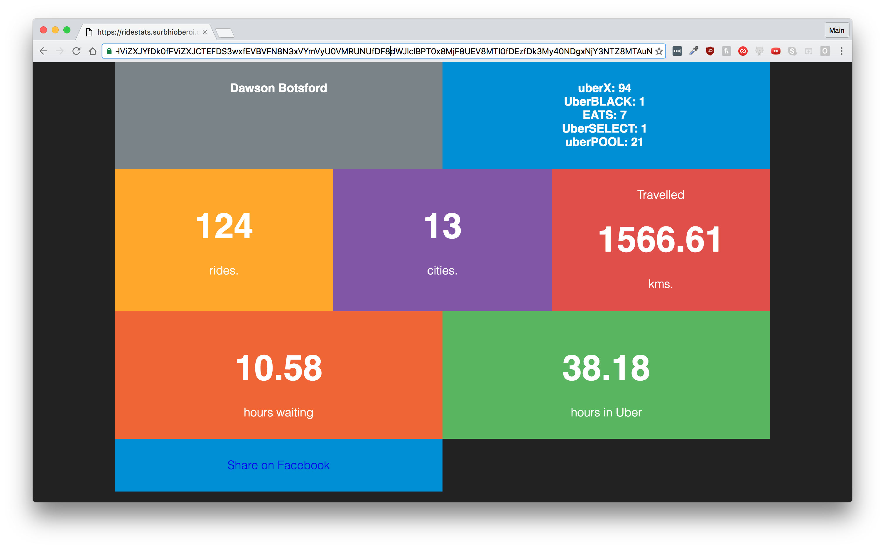

# ridestats 

> A web app for cool stats about your Uber rides

## Try it

http://ridestats.surbhioberoi.com

## Displayed Information

* Name of the account holder.
* Number of cities where Uber was used.
* Number of rides taken and in different product types.
* Kilometers travelled in Uber.
* Total time spent waiting for an Uber.
* Total time spent in an Uber.
  
You can use this app and check your own cool stats, results can also be shared on facebook. 

I have blogged about creating this app at 
http://surbhioberoi.com/a-literature-geek-learns-to-code/
